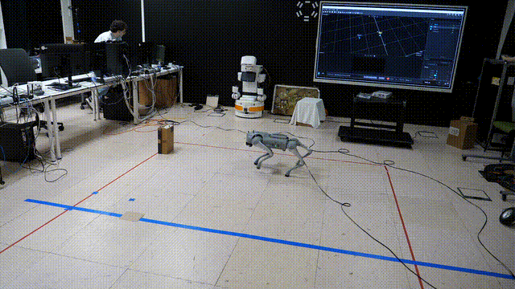

# TFG_GO2
Repositorio del Trabajo de Fin de Grado “Aprendizaje autónomo de modelos de mundo y de utilidad para robots cuadrúpedos” para el grado de Ingeniería Informática por la rama de computación en la UDC.

En este proyecto se desarrolla un sistema deliberativo de toma de decisiones para un robot cuadrúpedo Unitree Go2, basado en el aprendizaje supervisado de modelos de mundo y modelos de utilidad. El objetivo principal es que el robot pueda evaluar distintas acciones posibles, predecir sus consecuencias y seleccionar aquella que resulte más adecuada para cumplir un objetivo.



## Descripción del proyecto

El sistema desarrollado se basa en la combinación de dos modelos principales:

- Modelo de mundo (World Model): predice el estado siguiente del entorno a partir del estado actual del robot y de la acción seleccionada.
- Modelo de utilidad (Utility Model): estima la utilidad de un estado predicho, indicando lo favorable que resulta para alcanzar el objetivo.

Durante cada iteración, el sistema obtiene las observaciones actuales del entorno, genera predicciones para diferentes acciones disponibles, evalúa la utilidad de los estados predichos y selecciona la acción con mayor utilidad estimada. Posteriormente, dicha acción se ejecuta sobre el robot.

## Tecnologías utilizadas

- Python para el desarrollo de los scripts principales.
- TensorFlow / Keras para el entrenamiento de los modelos.
- Unitree SDK para el control del robot Unitree Go2.
- OptiTrack / NatNet SDK para la obtención de datos de captura de movimiento.
- MuJoCo para los modelos y pruebas en simulación.
- NumPy, Matplotlib y Pickle para el tratamiento de datos, visualización y almacenamiento de información.

## Estructura del repositorio

```text
TFG_GO2/ 
├── Codigo/             #Codigo del proyecto, modelos, datos y graficas
│ └── RealRobot/        #Scripts utilizados con el robot real 
│ 
├── Memoria/ 
│ └── modelo-tfg-fic-v1.6_2223xun/      # Documentación y memoria del TFG 
│ 
├── VideosRobot/            #Videos de demostracion del robot
├── model_unitree_go2/      # Modelo del robot Go2 para MuJoCo 
├── README.md 
└── LICENSE
```

## Funcionamiento general

El flujo principal del sistema es el siguiente:

1. Se obtiene la observación actual del entorno.
2. Se generan varias acciones posibles para el robot.
3. Para cada acción, el modelo de mundo predice el estado siguiente.
4. El modelo de utilidad evalúa cada estado predicho.
5. Se selecciona la acción con mayor utilidad estimada.
6. La acción se ejecuta sobre el robot real.

De esta forma, el robot no ejecuta acciones de manera aleatoria durante la demostración, sino que utiliza los modelos entrenados para escoger la acción más conveniente en función del objetivo.

## Instalación

Clonar el repositorio:

```bash
git clone https://github.com/s-lopez5/TFG_GO2.git
cd TFG_GO2
```
Instalar las dependencias principales:

```bash
pip install numpy matplotlib tensorflow
```

Además, para poder ejecutar estos scripts es necesario disponer de un robot Unitree Go2 conectado mediante Ethernet al ordenador y de un equipo auxiliar con Motive conectado a la misma red WiFi que gestione el sistema de camaras Optitrack.

## Licencia

Este proyecto se distribuye bajo la licencia **Creative Commons Attribution 4.0 International (CC BY 4.0)**.

Esto permite compartir y adaptar el contenido del repositorio, siempre que se dé crédito al autor original.


## Autor

Santiago Lopez Silva

Trabajo de Fin de Grado en Ingeniería Informática.